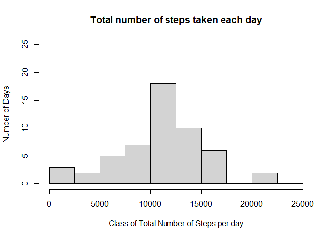
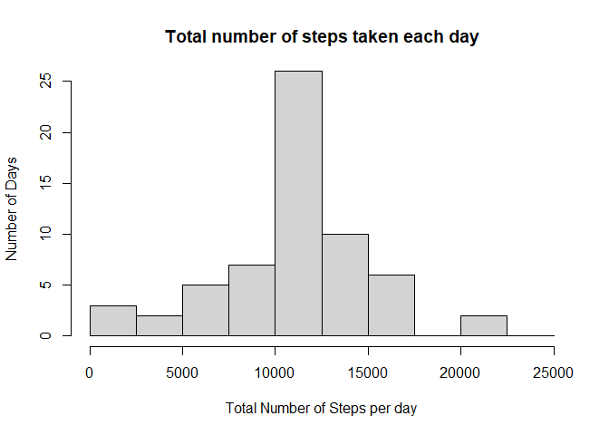
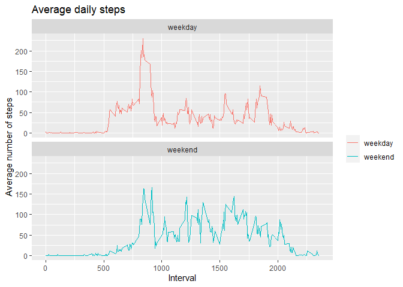

## Loading and preprocessing the data


```r
# Set echo = TRUE for all code chunks 
knitr::opts_chunk$set(echo = TRUE) 
# Load ggplot library
library(ggplot2)

# Import data
activity <- read.csv("activity.csv")

#Pre-process the data (optional)
activity$date <- as.Date(activity$date, "%Y-%m-%d")
summary(activity)
```

```
##      steps             date               interval     
##  Min.   :  0.00   Min.   :2012-10-01   Min.   :   0.0  
##  1st Qu.:  0.00   1st Qu.:2012-10-16   1st Qu.: 588.8  
##  Median :  0.00   Median :2012-10-31   Median :1177.5  
##  Mean   : 37.38   Mean   :2012-10-31   Mean   :1177.5  
##  3rd Qu.: 12.00   3rd Qu.:2012-11-15   3rd Qu.:1766.2  
##  Max.   :806.00   Max.   :2012-11-30   Max.   :2355.0  
##  NA's   :2304
```


## What is mean total number of steps taken per day? 
### (ignoring missing values)

1. Calculate the total number of steps taken per day

```r
totalStepsByDay<-aggregate(steps~date, activity, sum)
```

2. Make a histogram of the total number of steps taken each day

```r
hist(totalStepsByDay$steps, breaks = seq(0,25000,by=2500), ylim = c(0,25), xlab="Class of Total Number of Steps per day", ylab="Number of Days", main="Total number of steps taken each day")
```

<!-- -->

3. Calculate and report the mean and median of the total number of steps taken per day


```r
# Mean
mean(totalStepsByDay$steps, na.rm = TRUE) 
```

```
## [1] 10766.19
```

```r
# Median
median(totalStepsByDay$steps, na.rm = TRUE) 
```

```
## [1] 10765
```


## What is the average daily activity pattern?

1. Make a time series plot (i.e. \color{red}{\verb|type = "l"|}type = "l") of the 5-minute interval (x-axis) and the average number of steps taken, averaged across all days (y-axis)


```r
averageStepsByInterval <- aggregate(activity$steps, by = list(activity$interval), mean, na.rm = TRUE)
# assign names to columns
names(averageStepsByInterval) <- c("interval", "mean")
plot(averageStepsByInterval$interval, averageStepsByInterval$mean, type = "l",
     xlab="Interval", 
     ylab="Average number of steps")
```

<!-- -->


2. Which 5-minute interval, on average across all the days in the dataset, contains the maximum number of steps?


```r
# First find max in Mean, then corresponding Interval
averageStepsByInterval[which.max(averageStepsByInterval$mean),]$interval
```

```
## [1] 835
```


## Imputing missing values

1. Calculate and report the total number of missing values in the dataset (i.e. the total number of rows with \color{red}{\verb|NA|}NAs)

```r
sum(is.na(activity$steps))
```

```
## [1] 2304
```

2. Devise a strategy for filling in all of the missing values in the dataset. The strategy does not need to be sophisticated. For example, you could use the mean/median for that day, or the mean for that 5-minute interval, etc.

Missing values are replaced by the average 5-minute interval

```r
# Replace each missing value in the Steps column from original data set 
# with ROUNDED average number of steps for that interval 
# (since physically steps are integers)
CompleteSteps <- ifelse(is.na(activity$steps), round(averageStepsByInterval$mean), activity$steps)
```


3. Create a new dataset that is equal to the original dataset but with the missing data filled in.


```r
activity_noNA <- data.frame(steps=CompleteSteps, interval=activity$interval, date=activity$date)
```


4. Make a histogram of the total number of steps taken each day and Calculate and report the mean and median total number of steps taken per day. Do these values differ from the estimates from the first part of the assignment? What is the impact of imputing missing data on the estimates of the total daily number of steps?


```r
totalStepsByDay_noNA <- aggregate(steps~date, activity_noNA, sum)
hist(totalStepsByDay_noNA$steps,breaks = seq(0,25000,by=2500), ylim = c(0,25), xlab="Total Number of Steps per day", ylab="Number of Days", main="Total number of steps taken each day")
```

<!-- -->

Mean of the toal number of steps take per day is:

```r
mean(totalStepsByDay_noNA$steps)
```

```
## [1] 10765.64
```

and median is:


```r
median(totalStepsByDay_noNA$steps)
```

```
## [1] 10762
```
It can be seen that replacing missing values with mean for that interval  caused the change on histogram in the bin corresponding to the interval between 10000 and 12500 steps, as the number of days increased from 18 to 26. Although the mean and median values did change, they still remain somewhat close to the original values.   


## Are there differences in activity patterns between weekdays and weekends?

1. Create a new factor variable in the dataset with two levels – “weekday” and “weekend” indicating whether a given date is a weekday or weekend day.


```r
activity_noNA$day <-weekdays(activity_noNA$date)
activity_noNA$dayType <- ifelse(activity_noNA$day=='Saturday' | activity_noNA$day =='Sunday', 'weekend','weekday')
```


2. Make a panel plot containing a time series plot (i.e. \color{red}{\verb|type = "l"|}type = "l") of the 5-minute interval (x-axis) and the average number of steps taken, averaged across all weekday days or weekend days (y-axis). See the README file in the GitHub repository to see an example of what this plot should look like using simulated data.


```r
averageStepsByIntervalByDayType <- aggregate(steps~interval + dayType, activity_noNA,mean)

plot<- ggplot(averageStepsByIntervalByDayType, aes(x = interval , y = steps, color = dayType)) +
    geom_line() +
    labs(title = "Average daily steps ", x = "Interval", y = "Average number of steps") +
    facet_wrap(~dayType, ncol = 1, nrow=2)+
    theme(legend.title=element_blank())
print(plot)
```

<!-- -->

